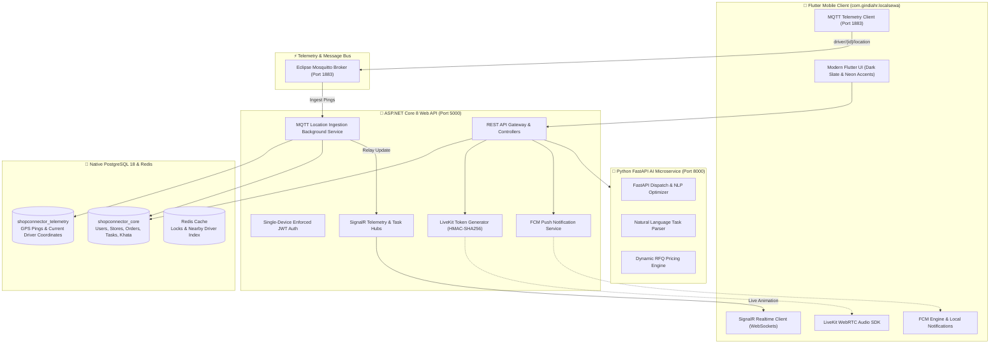

<div align="center">

# 🚀 LocalConnect (ShopConnector)
### Next-Gen Unified Hyper-Local Commerce, On-Demand Delivery & Mobility Platform

[](https://dotnet.microsoft.com/)
[](https://flutter.dev/)
[](https://www.postgresql.org/)
[](https://mosquitto.org/)
[](https://livekit.io/)
[](https://fastapi.tiangolo.com/)
[](https://opensource.org/licenses/MIT)

<p align="center">
  <b>Enterprise multi-tenant ecosystem connecting Customers, Local Merchants, Logistics Drivers, and Central Administrators with sub-second MQTT GPS telemetry, triangular LiveKit VoIP calling, and autonomous AI dispatch.</b>
</p>

---

</div>

## 📌 Table of Contents
- [Architecture Overview](#-architecture-overview)
- [Key Features](#-key-features)
- [System Technology Stack](#-system-technology-stack)
- [Multi-Tenant Role Matrix & Demo Credentials](#-multi-tenant-role-matrix--demo-credentials)
- [Real-time Telemetry & Ingestion (MQTT + PostGIS)](#-real-time-telemetry--ingestion-mqtt--postgis)
- [LiveKit Triangular VoIP Calling](#-livekit-triangular-voip-calling)
- [FCM Push Engine & Sound Alerts](#-fcm-push-engine--sound-alerts)
- [Prerequisites & Native Windows Setup](#-prerequisites--native-windows-setup)
- [One-Click Startup (`start_all.ps1`)](#-one-click-startup-start_allps1)
- [Android Release Build & Keystore Configuration](#-android-release-build--keystore-configuration)
- [Repository & License](#-repository--license)

---

## 🏛 Architecture Overview



---

## ✨ Key Features

### 1. 📍 Real-Time Telemetry & Mosquitto Ingestion
- **Ultra-Low Latency:** Drivers transmit live GPS coordinates every 4s directly over MQTT topic `driver/{driverId}/location`.
- **Durable Persistence:** Ingested into `shopconnector_telemetry.driver_gps_pings` and upserted into `driver_location_current`.
- **Live Moving Map Widget:** Flutter Map marker smoothly animates in real-time as the driver navigates without page reloads.

### 2. 📞 Triangular LiveKit WebRTC VoIP Calling
- Direct seamless voice calls between **Customer $\longleftrightarrow$ Shop Owner $\longleftrightarrow$ Driver**.
- Styled with modern dark glassmorphism, animated **Neon Voice Orbs**, and **Real-Time Dynamic Audio Waveform HUD**.
- Background incoming call heads-up notifications with instant `[Accept]` and `[Decline]` actions.

### 3. 🛡 Single-Device Order Execution Enforcement (Anti-Fraud)
- Strict security rule: **A driver cannot log in to two devices simultaneously to execute the same active order.**
- Attempts to accept tasks from unauthorized devices or report telemetry outside the active device token return `403 Forbidden` and `409 Conflict`.

### 4. 🔔 High-Priority FCM Push Notification Engine
- Android Notification Channels: `shopconnector_ongoing_orders` & `shopconnector_calls`.
- Loud system audio alert (`SystemSound.alert`) and haptic feedback on incoming dispatches, quote approvals, pickup OTPs, and ride updates.
- Auto-refreshes app UI state reactively upon receiving silent background data payloads.

### 5. 🏪 Hyper-Local Commerce & Multi-Shop Rate Card
- Customers can broadcast Request for Quotes (RFQ) across up to 3 nearby shops.
- Compare live pricing side-by-side, accept the best deal, and auto-dispatch the nearest verified delivery partner.

### 6. 🛣 Intercity Ride Pooling / Banner Feed
- Drivers can post scheduled intercity routes (e.g. *Jaipur ➔ Delhi*, 3 seats @ ₹1,500).
- Customers can view, reserve, and pay for seats in an interactive banner card.

### 7. 📒 Digital Khata & Merchant Ledger
- Full merchant digital credit ledger (Udhar Khata) for local customer accounts with automated reminder notifications.

---

## 🛠 System Technology Stack

| Layer | Technologies & Libraries |
|---|---|
| **Mobile App** | Flutter 3.44+, Dart 3.12+, `flutter_map`, `latlong2`, `mqtt_client`, `livekit_client`, `firebase_messaging`, `flutter_local_notifications`, `audioplayers`, `provider` |
| **Backend API** | ASP.NET Core 8.0, C# 12, Entity Framework Core 8, Npgsql NetTopologySuite, SignalR, BCrypt.Net, System.IdentityModel.Tokens.Jwt |
| **Telemetry & Messaging** | Eclipse Mosquitto MQTT Broker (1883), MQTTnet 4.3.7 Ingestion Service |
| **Databases** | PostgreSQL 18.0 (`shopconnector_core`, `shopconnector_telemetry`), PostGIS spatial indexing, Redis 7+ |
| **AI Microservice** | Python 3.12, FastAPI, Uvicorn, Pydantic v2 |
| **VoIP & Audio** | LiveKit WebRTC Cloud/Self-Hosted Engine with JWT Room Token auth |
| **Android Packaging** | Package `com.gindiahr.localsewa`, Gradle 8.4+, Release Keystore `localconnect.jks` |

---

## 👥 Multi-Tenant Role Matrix & Demo Credentials

All test accounts are pre-seeded and configured for instant 4-digit PIN login:

| Role | Name | Phone Number | 4-Digit PIN | Key Capabilities |
|---|---|---|---|---|
| **Top Admin** | Top Admin LocalConnect | `9350065724` | `1234` | Full platform monitoring, dispatch override, audit logs & telemetry tracking |
| **Driver** | Ramesh Kumar Driver | `9876543210` | `1234` | Duty toggle (`Free`/`Busy`), MQTT GPS broadcaster, intercity banners, trip OTP verification |
| **Merchant** | Sharma Kirana & General | `9123456780` | `1234` | Inventory management, RFQ quotation, customer Khata ledger, direct calling |
| **Customer** | Rahul Verma | `9000000001` | `1234` | Instant ride booking, 3-shop rate comparison, live driver map, VoIP call |

> **Quick-Fill Buttons:** The Flutter login screen features one-tap quick-fill buttons for each role for rapid pair-programming and client demonstrations.

---

## 📡 Real-time Telemetry & Ingestion (MQTT + PostGIS)

### MQTT Topics
- **Driver GPS Publish:** `driver/{driverId}/location`
- **Task Tracking Broadcast:** `tasks/{taskId}/tracking`
- **Driver Tracking Broadcast:** `driver/{driverId}/tracking`

### Sample Ingestion Payload
```json
{
  "driverId": "d2daea1b-32dc-4bef-89db-fab0a1de7976",
  "taskId": "7c9e6679-7425-40de-944b-e07fc1f90ae7",
  "deviceId": "pixel_7_pro",
  "latitude": 25.5941,
  "longitude": 85.1376,
  "speed": 42.5,
  "heading": 180.0,
  "accuracy": 4.2,
  "batteryPct": 88,
  "isCharging": false,
  "timestamp": "2026-09-25T01:06:15Z"
}
```

### PostgreSQL Telemetry Schema
```sql
-- High-frequency ping log
SELECT id, driver_id, latitude, longitude, speed, timestamp 
FROM driver_gps_pings ORDER BY timestamp DESC LIMIT 5;

-- Instant lookup of current location
SELECT driver_id, latitude, longitude, speed, heading, updated_at 
FROM driver_location_current WHERE driver_id = '...';
```

---

## 🚀 Prerequisites & Native Windows Setup

> **Note:** This project is built natively for Windows 11 (No Docker required).

### 1. Requirements
- [.NET 8.0 SDK](https://dotnet.microsoft.com/download/dotnet/8.0)
- [Flutter SDK 3.44+](https://flutter.dev/docs/get-started/install)
- [PostgreSQL 18.x](https://www.postgresql.org/download/windows/) running on port `5432` with password `Kgn786#123;`
- [Eclipse Mosquitto](https://mosquitto.org/download/) running on port `1883`
- [Python 3.12](https://www.python.org/downloads/)

### 2. Database Initialization
```powershell
$env:PGPASSWORD="Kgn786#123;"
# Verify databases
& "C:\Program Files\PostgreSQL\18\bin\psql.exe" -U postgres -h localhost -c "CREATE DATABASE shopconnector_core;"
& "C:\Program Files\PostgreSQL\18\bin\psql.exe" -U postgres -h localhost -c "CREATE DATABASE shopconnector_telemetry;"
```

### 3. Backend API Startup
```powershell
cd src/ShopConnector.Api
dotnet run --urls "http://localhost:5000"
```
*Swagger UI is available at:* `http://localhost:5000/swagger`

### 4. AI Engine Startup
```powershell
cd ai-agent
python -m uvicorn app.main:app --host 127.0.0.1 --port 8000
```

### 5. Mobile App Launch
```powershell
cd mobile
flutter pub get
flutter run -d windows # Or select connected Android device
```

---

## ⚡ One-Click Startup (`start_all.ps1`)

Launch all core microservices, backend, and background workers concurrently with a single command:

```powershell
./start_all.ps1
```

This automated script performs:
1. Native service health check for PostgreSQL and Mosquitto Broker.
2. Auto-migration check for `shopconnector_core` and `shopconnector_telemetry`.
3. Starts the ASP.NET Core API on `http://localhost:5000`.
4. Starts the Python FastAPI AI Agent on `http://127.0.0.1:8000`.
5. Spawns Flutter client debugger.

---

## 🔑 Android Release Build & Keystore Configuration

The Android application is configured for production releases with Google Services and signing keys:

- **Package Name:** `com.gindiahr.localsewa`
- **Keystore Path:** `mobile/android/app/localconnect.jks`
- **Key Alias:** `localconnect`
- **Keystore Password:** `localconnect`
- **Key Password:** `localconnect`
- **Firebase Configuration:** `mobile/android/app/google-services.json` (Project: `driver-app-4b351`)

### Generate Production Android Bundle / APK
```powershell
cd mobile
flutter build apk --release
# Output: mobile/build/app/outputs/flutter-apk/app-release.apk
```

---

## 📄 Repository & License

- **Remote GitHub Repository:** [premranjanpro/local_connect](https://github.com/premranjanpro/local_connect)
- **License:** Licensed under the [MIT License](LICENSE).
- **Developed by:** Prem Ranjan & the Antigravity Engineering Team.
